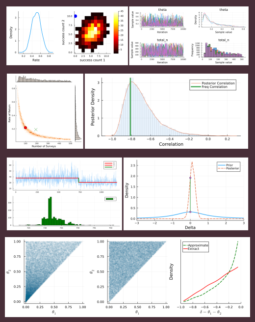
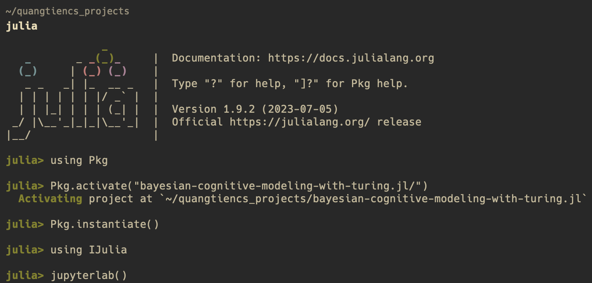

# Bayesian Cognitive Modeling with Turing.jl (Julia Programming Language)
bayesian-cognitive-modeling-with-turing.jl

---

Bayesian Cognitive Modeling is one of the classical books for Bayesian Inference. The old version used WinBUGS/JAG software as the main implementation. You can find other implementations, such as Stan and PyMC, in the below link. I reimplemented these models with Julia Programming Language & Turing library.

- WinBUGS/JAGS (official) & Stan: https://bayesmodels.com/
- PyMC: https://github.com/pymc-devs/pymc-resources/tree/main/BCM



### Using project's environment

Firstly, clone the repo

```shell
git clone https://github.com/quangtiencs/bayesian-cognitive-modeling-with-turing.jl.git
```

Then, open Julia REPL

